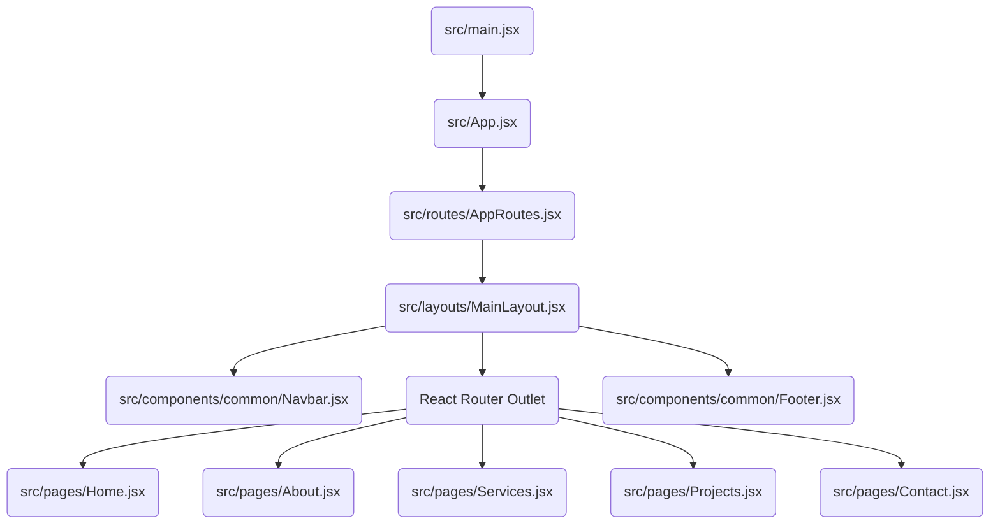

# Master React: Concepts & How They Run in Jothis Construction

Welcome to your personalized React learning guide! You have a beautiful, modern **React** codebase structured with **Vite**, **Tailwind CSS**, and **React Router**. 

Instead of learning from abstract examples, let's explore **exactly how React works by looking at your actual project files**.

---

## 🗺️ Visual Map of Your Code Architecture

Here is how your React application is structured:



---

## 1. 🧱 React Components (The Building Blocks)

### What it is:
A **Component** is a reusable, self-contained piece of UI. In modern React, components are simply **JavaScript functions** that return **JSX** (JavaScript XML—code that looks like HTML but has superpowers).

### How it is used in your project:
Every page and layout in your project is a component.
* Let's look at your `Home` page component: [Home.jsx](./src/pages/Home.jsx)
  ```javascript
  const Home = () => {
    // ... logic (stats, services arrays)
    return (
      <div className="bg-white min-h-screen text-gray-700">
        {/* JSX describing the user interface */}
      </div>
    );
  };
  export default Home;
  ```

> [NOTE]
> * **Capitalization Rule**: React component names must always start with a capital letter (e.g., `Home`, `Navbar`, `Button`). If it starts with a lowercase letter, React treats it as a standard HTML tag (like `<div>` or `<button>`).
> * **The Export**: By writing `export default Home`, you make this component available to be imported and displayed in other files (like in your router).

---

## 2. 🎛️ Props & Children (Component Configuration)

### What it is:
* **Props** (short for properties) are inputs passed from parent components to child components, just like arguments passed to a JavaScript function. They make components highly dynamic.
* **Children** is a special prop (`props.children`) that allows you to pass nested HTML or other components inside your custom component.

### How it is used in your project:
Open your reusable button: [Button.jsx](./src/components/common/Button.jsx)

```javascript
const Button = ({
  children,
  onClick,
  type = 'button',
  variant = 'primary',
  size = 'md',
  disabled = false,
  icon = null
}) => {
  // ...
  return (
    <button onClick={onClick} className={...}>
      {children}
    </button>
  );
};
```

#### Key Prop Techniques in your Code:
1. **Destructuring**: Instead of accepting a single `props` object, your code uses `{ children, onClick, variant }` to extract values directly.
2. **Default Props**: If the parent doesn't specify a value, React uses the default values defined in the parameters (e.g., `type = 'button'`, `variant = 'primary'`).
3. **The `{children}` Prop**: When you call `<Button>Contact Estimator</Button>` inside [Home.jsx](./src/pages/Home.jsx), the text `"Contact Estimator"` is passed automatically as `children` and rendered inside the HTML `<button>` tag!

Another great example is your [SectionTitle.jsx](./src/components/common/SectionTitle.jsx) component, which takes `title`, `subtitle`, and `description` props, ensuring headings look consistent across all pages.

---

## 3. 🧠 State Management with `useState` (Component Memory)

### What it is:
In React, standard variables do not trigger a visual update on the screen when their values change. To make a component "remember" data that changes over time and re-render the page, we use **State** via the `useState` hook.

### How it is used in your project:
You have fantastic examples of `useState` in two of your pages:

#### A. Accordions & Dynamic Forms in [Contact.jsx](./src/pages/Contact.jsx)
```javascript
const Contact = () => {
  const [submitted, setSubmitted] = useState(false);
  const [activeFaq, setActiveFaq] = useState(null);
  const [formData, setFormData] = useState({
    name: '',
    email: '',
    phone: '',
    projectType: 'residential',
    message: ''
  });
  // ...
```

* **`submitted`**: A simple boolean state. When the user fills out the form successfully, `setSubmitted(true)` is called, which immediately updates the UI to show a "Thank You" message.
* **`activeFaq`**: Keeps track of which FAQ accordion index is open. If `activeFaq === 2`, then the 3rd FAQ is shown. If it is `null`, all FAQs are closed.
* **`formData`**: Stores a whole object. When a user types in a field, the `handleInputChange` function updates this state:
  ```javascript
  setFormData({ ...formData, [name]: value });
  ```
  *(The `...formData` syntax is called the **Spread Operator**. It copies the existing state values so we only overwrite the specific field the user edited.)*

#### B. Dynamic Filtering in [Projects.jsx](./src/pages/Projects.jsx)
```javascript
const [filter, setFilter] = useState('all');
const [selectedProject, setSelectedProject] = useState(null);
```
* **`filter`**: Controls whether to show "All Work", "Residential", "Commercial", or "Renovation". When you click a tab, it updates this state, which recalculates the filtered list and displays it.
* **`selectedProject`**: Stores the project object that is currently clicked. If a project is clicked, it opens a beautiful pop-up Modal with its specs.

---

## 4. ⚡ Side Effects with `useEffect` (Connecting to the Outside World)

### What it is:
The `useEffect` hook lets you synchronize a component with an external system or run code in response to state changes or page loads. Examples include:
* Listening for global window events (like scrolling).
* Fetching data from an API.
* Subscribing/unsubscribing to timers or web sockets.

### How it is used in your project:
Open your [Navbar.jsx](./src/components/common/Navbar.jsx) component:

```javascript
const Navbar = () => {
  const [isOpen, setIsOpen] = useState(false);
  const [scrolled, setScrolled] = useState(false);
  const location = useLocation();

  // EFFECT 1: Scroll Listener
  useEffect(() => {
    const handleScroll = () => {
      if (window.scrollY > 10) {
        setScrolled(true);
      } else {
        setScrolled(false);
      }
    };

    window.addEventListener('scroll', handleScroll);
    return () => window.removeEventListener('scroll', handleScroll);
  }, []);

  // EFFECT 2: Route Change Auto-Close
  useEffect(() => {
    setIsOpen(false);
  }, [location]);
```

Let's dissect these two effects:

#### ⚡ Effect 1: Scroll Detector
* **Why it runs**: It attaches a scroll event listener to the browser window.
* **The Dependency Array (`[]`)**: The empty brackets `[]` tell React: *"Only run this effect once when the Navbar is first put on the screen (mounted)"*.
* **The Cleanup Function (`return () => ...`)**: This is crucial! When the user leaves this page or the component is removed, React runs the returned function to remove the scroll listener. This prevents **memory leaks** and keeps your app extremely fast.

#### ⚡ Effect 2: Route Sync
* **Why it runs**: In mobile view, the navigation menu occupies the screen. When a user clicks a link, the route changes.
* **The Dependency Array (`[location]`)**: Having `location` here tells React: *"Every single time the URL/route changes, run this effect"*. The effect sets `setIsOpen(false)`, which automatically closes the mobile dropdown menu!

---

## 5. 🔄 List Rendering & Keys (Displaying Arrays)

### What it is:
In React, we don't use `for` loops inside our HTML layout. Instead, we use the JavaScript `.map()` array method to convert an array of data objects into an array of JSX elements.

### How it is used in your project:
Look at the Stats section inside [Home.jsx](./src/pages/Home.jsx):

```javascript
const stats = [
  { number: "250+", label: "Projects Completed" },
  { number: "15+", label: "Years Experience" },
  // ...
];

// Inside the JSX return statement:
<div className="grid grid-cols-2 md:grid-cols-4 gap-6 text-center">
  {stats.map((stat, i) => (
    <div key={i} className="p-3 border-r border-gray-100 last:border-0">
      <span className="text-2xl font-bold text-gray-900 block mb-1">
        {stat.number}
      </span>
      <span className="text-xs font-semibold text-gray-550 uppercase">
        {stat.label}
      </span>
    </div>
  ))}
</div>
```

> [IMPORTANT]
> **Why do we need `key={i}` or `key={p.id}`?**
> When React renders lists, it needs a unique identifier for each item. This helps React's virtual DOM figure out exactly which items changed, were added, or were removed. Without keys, React has to re-render the *entire* list from scratch, causing performance degradation.

---

## 6. 🔀 Conditional Rendering (Dynamic Elements)

### What it is:
Conditional rendering is showing or hiding UI elements based on certain conditions (like checking if a state is true/false or if a variable is loaded).

### How it is used in your project:
You have two major patterns in your codebase:

#### A. Ternary Operators (`condition ? ifTrue : ifFalse`)
Used in [Contact.jsx](./src/pages/Contact.jsx) to switch between the form and the success screen:
```javascript
{!submitted ? (
  <form onSubmit={handleFormSubmit}>
    {/* Contact form inputs */}
  </form>
) : (
  <div className="text-center py-10">
    <h3>Specifications Submitted!</h3>
  </div>
)}
```

#### B. Logical AND (`condition && JSX`)
Used in [Projects.jsx](./src/pages/Projects.jsx) to show the pop-up modal only when a project is selected:
```javascript
{selectedProject && (
  <div className="fixed inset-0 z-50 flex items-center justify-center p-4">
    {/* Pop-up modal details */}
  </div>
)}
```
* **How it works**: In JavaScript, if the first part of an `&&` statement is `false` (e.g. `selectedProject` is `null`), it stops immediately and renders nothing. If it is `true` (a project object exists), it goes ahead and renders the JSX block.

---

## 7. 🚦 React Router (Routing & Layouts)

### What it is:
React builds **Single Page Applications (SPAs)**. This means instead of downloading a brand new HTML file from a server whenever you click a link, a library called **React Router** intercept links and instantly swaps out the page component on the screen without reloading the browser.

### How it is used in your project:
Check your routing center: [AppRoutes.jsx](./src/routes/AppRoutes.jsx)

```javascript
import { BrowserRouter, Routes, Route } from "react-router-dom";
import MainLayout from "../layouts/MainLayout";
import Home from "../pages/Home";
import About from "../pages/About";
// ...

const AppRoutes = () => {
  return (
    <BrowserRouter>
      <Routes>
        <Route element={<MainLayout />}>
          <Route path="/" element={<Home />} />
          <Route path="/about" element={<About />} />
          <Route path="/services" element={<Services />} />
          <Route path="/projects" element={<Projects />} />
          <Route path="/contact" element={<Contact />} />
        </Route>
      </Routes>
    </BrowserRouter>
  );
};
```

#### 💡 The Parent-Child Route layout:
1. Notice how `MainLayout` wraps all other routes.
2. If you open [MainLayout.jsx](./src/layouts/MainLayout.jsx), you will see:
   ```javascript
   const MainLayout = () => {
     return (
       <>
         <Navbar />
         <Outlet />
         <Footer />
       </>
     );
   };
   ```
3. The `<Outlet />` is a placeholder component from React Router. When you go to `/about`, React Router inserts the `<About />` component inside the `<Outlet />`, leaving the `<Navbar />` and `<Footer />` exactly where they are. This creates seamless page transitions without headers/footers blinking or resetting!

---

## 🚀 Summary Checklist of What You Learned

| React Topic | Key Keyword/Hook | Where to find it in your project | What it does |
| :--- | :--- | :--- | :--- |
| **Components** | `function` / JSX | [Home.jsx](./src/pages/Home.jsx) | Reusable blocks of user interface. |
| **Props** | `{ children, variant }` | [Button.jsx](./src/components/common/Button.jsx) | Variables passed from parent to configure children. |
| **State** | `useState()` | [Contact.jsx](./src/pages/Contact.jsx) | Local memory that causes a page re-render when changed. |
| **Side Effects** | `useEffect()` | [Navbar.jsx](./src/components/common/Navbar.jsx) | Running code for events, timers, or changes with cleanups. |
| **List Rendering** | `.map()` & `key` | [Home.jsx](./src/pages/Home.jsx) | Dynamically rendering loops of data arrays. |
| **Conditional View** | `? :` and `&&` | [Projects.jsx](./src/pages/Projects.jsx) | Hiding or showing elements based on state checks. |
| **Single Page Router** | `<Outlet />` & `useLocation` | [MainLayout.jsx](./src/layouts/MainLayout.jsx) | Simulates real web pages inside one initial index.html load. |

---

### 💡 Practice Exercises to Try Right Now:
1. **Change a Prop**: Go to [Home.jsx](./src/pages/Home.jsx) and change the variant of the second button from `"secondary"` to `"text"`. See how the visual style immediately transforms!
2. **Add a FAQ**: Go to [Contact.jsx](./src/pages/Contact.jsx) and add a new question/answer object to the `faqs` array. See how it automatically generates a new interactive accordion on the Contact page.
3. **Change the Filter Default**: Go to [Projects.jsx](./src/pages/Projects.jsx) and change `useState('all')` to `useState('residential')`. Refresh and observe how only residential projects show up by default!
